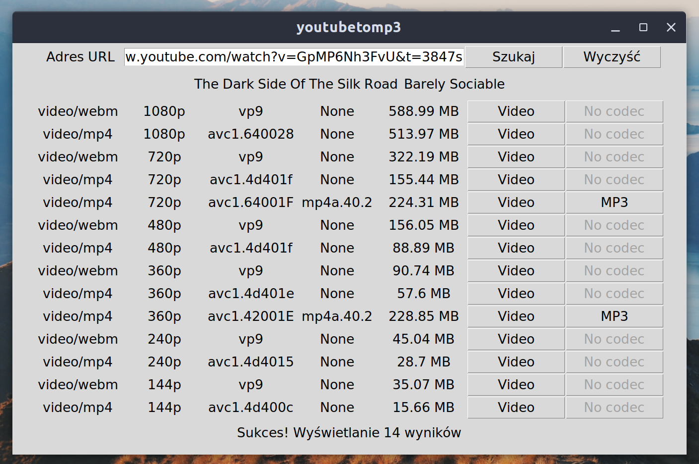

```
                      __        __            __                          _____
   __  ______  __  __/ /___  __/ /_  ___     / /_____     ____ ___  ____ |__  /
  / / / / __ \/ / / / __/ / / / __ \/ _ \   / __/ __ \   / __ `__ \/ __ \ /_ <
 / /_/ / /_/ / /_/ / /_/ /_/ / /_/ /  __/  / /_/ /_/ /  / / / / / / /_/ /__/ /
 \__, /\____/\__,_/\__/\__,_/_.___/\___/   \__/\____/  /_/ /_/ /_/ .___/____/
/____/                                                          /_/
```

|Description|
|:-|
|Simplistic GUI app made in Python - download a video from youtube.com and convert it to mp3|
___
|Dependencies||
|-|-|
|ffmpeg|`$ apt-get install ffmpeg`|
|pytube3|`$ python -m pip install pytube3`|
|tkinter|`$ python -m pip install tkinter`|
___
|Known issues|
|:-|
|Sometimes the `title` of the video doesn't load properly - to avoid this click the search button again|
|Receiving HTTP 404 Error when `?v=<tag>` includes `-` or `_`|


